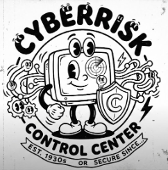
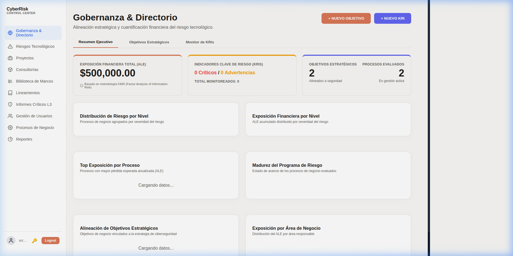
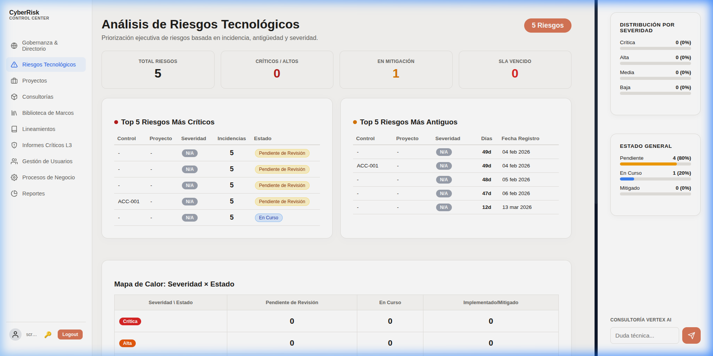
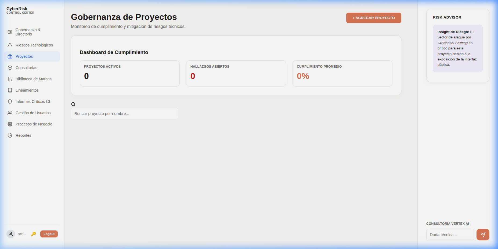
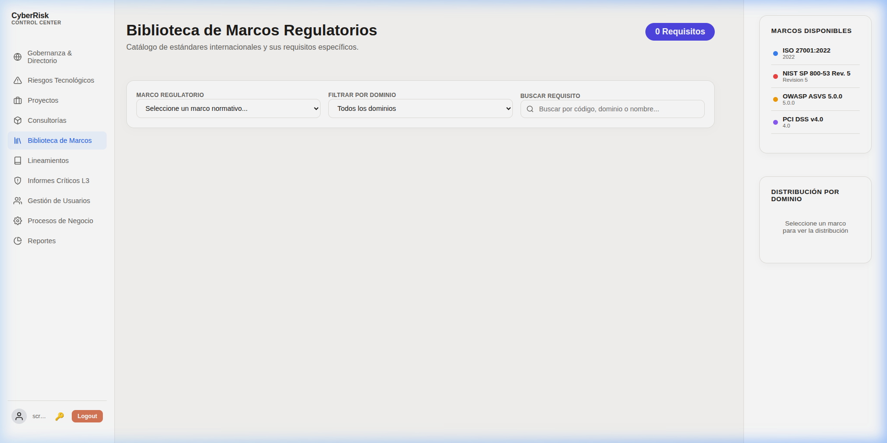

# 🛡️ CyberRisk Control Center (CCC)



## Overview
CyberRisk Control Center (CCC) is a comprehensive, open-source platform designed to streamline cybersecurity risk management, regulatory compliance, and governance. Built for security managers, engineers, and administrators, it provides a centralized dashboard to track risks, manage controls, and ensure alignment with global security standards.

> **SGRT – Sistema de Gobernanza de Riesgo Tecnológico**

## 🚀 Key Features

### 📊 Gobernanza & Directorio
Strategic alignment and financial quantification of technology risk using the **FAIR methodology**. Monitor **Key Risk Indicators (KRIs)**, **Annualized Loss Expectancy (ALE)**, and strategic objectives in real-time.



### 🔥 Riesgos Tecnológicos
Executive risk analysis with heat maps, severity distribution charts, and critical/oldest risk tracking to prioritize remediation efforts.



### 📁 Proyectos de Ciberseguridad
Modern compliance dashboard to track security projects, open findings, and global compliance percentage. Includes an AI-powered **Risk Advisor** (Vertex AI).



### 🔍 Consultorías (RCS)
Risk Control Self-assessment registry for managing findings and tracking control remediation from security consultancies.

### 📚 Biblioteca de Marcos Regulatorios
Integrated repository with international compliance standards:
- **ISO/IEC 27001:2022** – Information Security Management Systems (ISMS)
- **NIST SP 800-53 Rev. 5** – 313+ Security & Privacy Controls
- **OWASP ASVS 5.0.0** – 341+ Application Security Requirements
- **PCI DSS v4.0** – Payment Card Industry Data Security Standard



### ⚠️ Informes Críticos L3
Manage critical security incidents and vulnerabilities that represent significant financial risk to the organization.

### ⚙️ Procesos de Negocio
Business process risk evaluation with financial quantification (FAIR-lite: Asset Value × Exposure Factor × Annualized Rate of Occurrence = ALE).

### 🔐 Seguridad
- **Role-Based Access Control (RBAC)**: Admin, Security Manager, Engineer.
- **JWT Authentication** with bcrypt password hashing.
- **HTTPS** communication with TLS certificates.

## 🛠️ Tech Stack
| Layer | Technology |
|---|---|
| **Frontend** | HTML5, CSS3 (Glassmorphism), Vanilla JavaScript (SPA) |
| **Backend** | Node.js + Express.js |
| **Database** | MongoDB + Mongoose ODM |
| **Auth** | JWT + bcryptjs |
| **AI** | Vertex AI (Risk Advisor) |

## 📦 Quick Installation

### Prerequisites
- [Node.js](https://nodejs.org/) (v16.x or higher)
- [MongoDB](https://www.mongodb.com/) (Local instance or Atlas connection string)
- [Git](https://git-scm.com/)

### One-Step Setup (Linux/macOS)
```bash
bash install.sh
```

### Manual Installation
1. **Clone the repository:**
   ```bash
   git clone https://github.com/alexweb17/CyberRiskControlCenter.git
   cd CyberRiskControlCenter
   ```

2. **Install dependencies:**
   ```bash
   npm install
   ```

3. **Configure Environment:**
   Copy the example environment file and update it with your own values:
   ```bash
   cp .env.example .env
   ```
   *Note: Ensure `.env` is updated with your MongoDB connection string and a secure `JWT_SECRET`.*

4. **Seed the database (regulatory frameworks):**
   This repository includes automated scripts in the `scripts/` directory to load pre-configured security frameworks (ISO 27001, NIST, OWASP ASVS, PCI DSS):
   ```bash
   node scripts/seed_master_es.js
   ```

5. **Run the application:**
   ```bash
   npm start
   ```
   Access the UI at `https://localhost:3000`.

## 🔑 First Login

On the **first startup**, if no users exist in the database, the server automatically creates a default administrator account:

| Field | Value |
|---|---|
| **Email** | `admin@occc.local` |
| **Password** | `OpenCyberRisk2026!` |
| **Role** | `admin` |

> ⚠️ **IMPORTANT:** Change the default password immediately after your first login via the user profile menu (🔒 icon).

## 📖 Documentation

| Document | Description |
|---|---|
| [📖 Manual de Usuario](docs/MANUAL.md) | Complete user manual with screenshots and cybersecurity concept explanations (KRI, ALE, ISO, OWASP, PCI DSS, L3 Reports, etc.) |
| [🔧 Guía para Desarrolladores](docs/DEVELOPER_GUIDE.md) | Architecture, API endpoints, seeding process, data model, and code conventions |
| [📚 Biblioteca de Marcos](Biblioteca%20de%20Marcos/) | Source Markdown files for regulatory frameworks (NIST, OWASP ASVS, ISO 27001) |

## 🤝 Contributing
Contributions are what make the open-source community such an amazing place to learn, inspire, and create. Any contributions you make are **greatly appreciated**.

1. Fork the Project
2. Create your Feature Branch (`git checkout -b feature/AmazingFeature`)
3. Commit your Changes (`git commit -m 'Add some AmazingFeature'`)
4. Push to the Branch (`git push origin feature/AmazingFeature`)
5. Open a Pull Request

## 📜 License
This project is licensed under the **MIT License** - see the [LICENSE](LICENSE) file for details.

## 👤 Author
**Alex Arana Northia** - *Design & Implementation*

---
*Developed with focus on efficiency and security excellence.*
