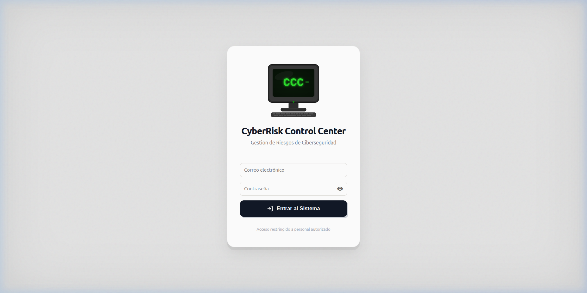
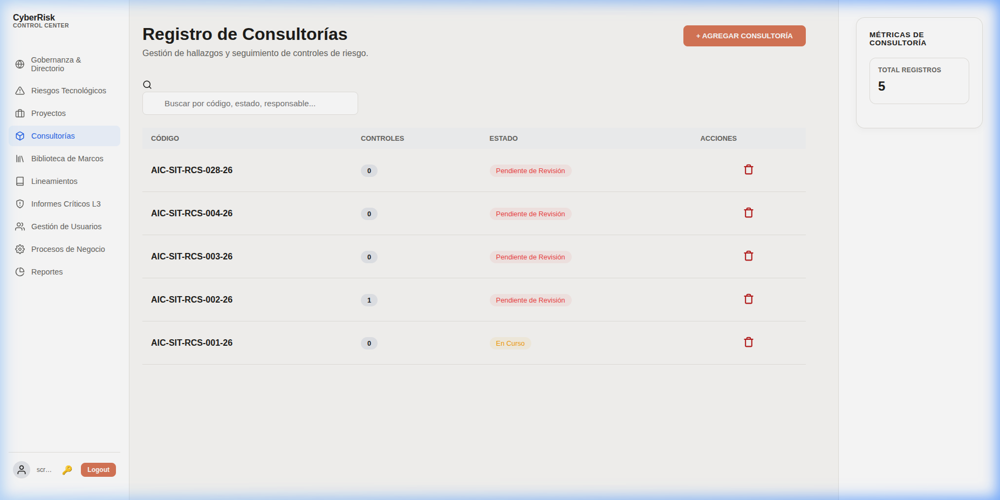
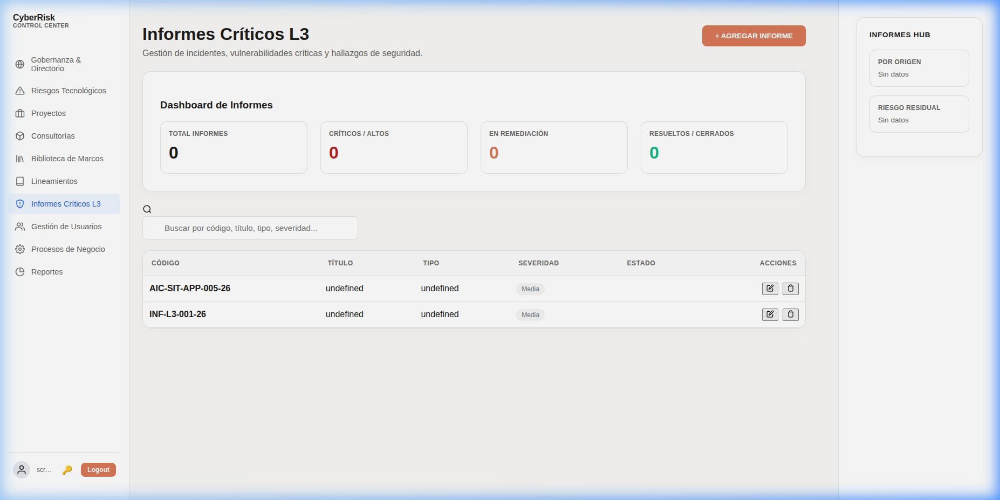
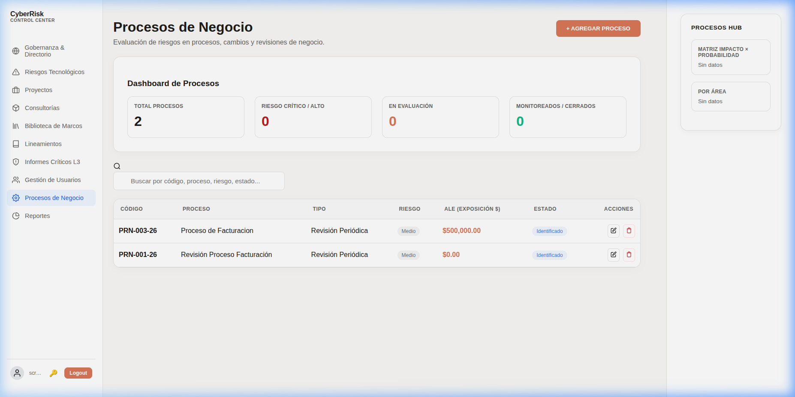

# 📖 Manual de Usuario - CyberRisk Control Center (CCC)

> **SGRT – Sistema de Gobernanza de Riesgo Tecnológico**

Bienvenido al manual completo del CyberRisk Control Center. Esta guía describe cada módulo de la plataforma, los conceptos clave de ciberseguridad que la sustentan y cómo utilizarla para gobernar el riesgo tecnológico de tu organización.

---

## Tabla de Contenidos

1. [Inicio de Sesión](#1-inicio-de-sesión)
2. [Proyectos](#2-proyectos)
3. [Gobernanza & Directorio](#3-gobernanza--directorio)
4. [Riesgos Tecnológicos](#4-riesgos-tecnológicos)
5. [Consultorías (RCS)](#5-consultorías-rcs)
6. [Biblioteca de Marcos Regulatorios](#6-biblioteca-de-marcos-regulatorios)
7. [Informes Críticos L3](#7-informes-críticos-l3)
8. [Procesos de Negocio](#8-procesos-de-negocio)
9. [Glosario de Conceptos Clave](#9-glosario-de-conceptos-clave)

---

## 1. Inicio de Sesión



El CyberRisk Control Center utiliza autenticación basada en **JWT (JSON Web Tokens)** con contraseñas cifradas mediante **bcrypt**. El acceso se gestiona a través de **RBAC (Role-Based Access Control)** con tres niveles:

| Rol | Permisos |
|---|---|
| **Admin** | Acceso completo: gestión de usuarios, marcos regulatorios, todos los módulos. |
| **Security Manager** | Gestión de proyectos, consultorías, controles maestros e informes. |
| **Engineer** | Consulta y ejecución de tareas asignadas dentro de proyectos y consultorías. |

---

## 2. Proyectos


### ¿Qué es un Proyecto en ciberseguridad?

Un **Proyecto de Ciberseguridad** es una iniciativa planificada y acotada en el tiempo que busca mejorar la postura de seguridad de la organización. Ejemplos incluyen:

- Implementación de un sistema de detección de intrusiones (IDS/IPS).
- Migración de infraestructura al modelo Zero Trust.
- Auditoría de cumplimiento PCI DSS para el área de pagos.
- Despliegue de solución EDR (Endpoint Detection & Response).

### Funcionalidades del módulo

- **Dashboard de Cumplimiento**: Muestra proyectos activos, hallazgos abiertos y porcentaje de cumplimiento global.
- **Seguimiento por proyecto**: Cada proyecto tiene un líder, ingeniero asignado, área responsable, fecha de solicitud y fecha de emisión.
- **Controles asignados**: Cada proyecto vincula controles maestros específicos que deben cumplirse.
- **Risk Advisor**: Panel lateral con insights de riesgo generados por IA (Vertex AI), que analiza vectores de ataque relevantes para cada proyecto.

---

## 3. Gobernanza & Directorio


Este es el **centro neurálgico** de la plataforma. Conecta la estrategia organizacional con la cuantificación financiera del riesgo tecnológico.

### Secciones principales

#### 🔴 Exposición Financiera Total (ALE)

La **ALE (Annualized Loss Expectancy)** o **Expectativa de Pérdida Anualizada** es la métrica central de cuantificación financiera. Representa el costo monetario estimado que la organización podría perder anualmente debido a los riesgos tecnológicos identificados.

Se calcula utilizando la **metodología FAIR (Factor Analysis of Information Risk)**:

```
ALE = Valor del Activo × Factor de Exposición × Tasa Anual de Ocurrencia
```

> **Ejemplo**: Si un servidor crítico vale $1.000.000, tiene un factor de exposición del 50% y la probabilidad de incidente es 1 vez al año: ALE = $1.000.000 × 0.5 × 1 = **$500.000**.

#### 🟡 Indicadores Clave de Riesgo (KRIs)

Un **KRI (Key Risk Indicator)** es una métrica cuantitativa que funciona como un "termómetro" del riesgo. Los KRIs permiten monitorear en tiempo real si los niveles de riesgo se encuentran dentro de los umbrales aceptables.

Cada KRI tiene:
- **Umbral de advertencia** (warning): señala que el indicador se acerca a niveles peligrosos.
- **Umbral crítico** (critical): señala que se ha superado el nivel aceptable y se requiere acción inmediata.
- **Valor actual**: el estado real medido del indicador.

> **Ejemplos de KRIs**: Tiempo promedio de parcheo de vulnerabilidades críticas, porcentaje de empleados con capacitación de seguridad completada, número de incidentes de seguridad por mes.

#### 🟣 Objetivos Estratégicos

Vinculan las iniciativas de ciberseguridad con los objetivos del negocio. Cada objetivo tiene una prioridad (Alta/Media/Baja) y se asigna a un departamento.

#### Exposición Financiera por Área

Muestra cómo se distribuye el riesgo financiero (ALE) entre las diferentes áreas de la organización, permitiendo priorizar inversiones en seguridad donde más se necesitan.

---

## 4. Riesgos Tecnológicos


### ¿Qué es un Riesgo Tecnológico?

Un **riesgo tecnológico** es la posibilidad de que una amenaza explote una vulnerabilidad en los sistemas, procesos o infraestructura de TI, causando un impacto negativo al negocio. CCC ofrece un análisis ejecutivo de estos riesgos con:

- **Mapa de Calor**: Visualiza la relación entre la severidad del riesgo y su estado de atención (Nuevo, En Análisis, En Remediación, Escalado, Resuelto, Cerrado).
- **Top Riesgos Críticos**: Lista los riesgos con mayor severidad que requieren atención inmediata.
- **Riesgos más Antiguos**: Identifica riesgos que llevan más tiempo sin resolverse.
- **Distribución por Severidad**: Gráfico que muestra la proporción de riesgos Críticos, Altos, Medios y Bajos.

---

## 5. Consultorías (RCS)



### ¿Qué es una Consultoría de Ciberseguridad (RCS)?

Una **RCS (Risk Control Self-assessment)** o **Consultoría** es el registro formal de un análisis de seguridad realizado sobre un sistema, proceso o proyecto. Las consultorías nuclean los hallazgos de seguridad encontrados y los controles que deben aplicarse para mitigar los riesgos identificados.

### Estructura de una Consultoría

Cada RCS contiene:
- **Código único** (ej: `AIC-SIT-RCS-001`): Identificador del expediente.
- **Proyecto asociado**: Vincula la consultoría con el proyecto que la originó.
- **Responsable**: Persona encargada de la remediación.
- **Severidad máxima**: La clasificación más alta entre los hallazgos encontrados (Crítica, Alta, Media, Baja).
- **Estado**: Pendiente de Revisión → En Curso → Implementado/Mitigado.
- **Controles asociados**: Lista de controles (del catálogo maestro o marcos regulatorios) que deben implementarse.

### Ciclo de vida

```
Creación → Pendiente de Revisión → En Curso → Implementado/Mitigado
```

Cada control asociado sigue su propio flujo: **Pendiente → En Mitigación → Mitigado → Aceptado**.

---

## 6. Biblioteca de Marcos Regulatorios


### ¿Qué es un Marco Regulatorio de Ciberseguridad?

Un **marco regulatorio** es un conjunto de estándares, controles y mejores prácticas reconocidas internacionalmente que establecen las directrices para proteger la información y los sistemas de una organización. CCC integra los siguientes marcos:

---

### 🔵 ISO/IEC 27001:2022

**¿Qué es?** Es el estándar internacional de referencia para Sistemas de Gestión de Seguridad de la Información (**SGSI**). Publicado por la Organización Internacional de Normalización (ISO) y la Comisión Electrotécnica Internacional (IEC).

**¿Para qué sirve?** Proporciona un marco certificable para que las organizaciones protejan sus activos de información de forma sistemática. Cubre controles organizacionales, de personas, físicos y tecnológicos.

**¿A quién aplica?** A cualquier organización que desee demostrar un compromiso formal con la seguridad de la información, independientemente de su tamaño o industria.

---

### 🔴 NIST SP 800-53 Rev. 5

**¿Qué es?** Es el catálogo de controles de seguridad y privacidad publicado por el **National Institute of Standards and Technology (NIST)** de los Estados Unidos. La Revisión 5 contiene más de 1000 controles agrupados en 20 familias.

**¿Para qué sirve?** Proporciona un catálogo exhaustivo de controles para proteger las operaciones, los activos, los individuos y la infraestructura de las organizaciones. Es la referencia estándar para organizaciones gubernamentales y de infraestructura crítica.

**Familias de controles incluidas**: Control de Acceso (AC), Auditoría (AU), Gestión de Configuración (CM), Planificación de Contingencias (CP), Identificación y Autenticación (IA), Respuesta a Incidentes (IR), Protección de Medios (MP), Protección Física (PE), entre otras.

---

### 🟡 OWASP ASVS 5.0.0

**¿Qué es?** El **Application Security Verification Standard (ASVS)** es un marco del **Open Web Application Security Project (OWASP)** para verificar y probar la seguridad de aplicaciones web y móviles.

**¿Para qué sirve?** Define requisitos de seguridad en tres niveles de verificación (L1, L2, L3) que van desde la protección básica hasta la más rigurosa. Cubre codificación y sanitización, validación de entrada, autenticación, gestión de sesiones, criptografía y más.

**¿A quién aplica?** A equipos de desarrollo de software, auditores de seguridad de aplicaciones y empresas que deseen validar la seguridad de sus productos digitales.

---

### 🟣 PCI DSS v4.0

**¿Qué es?** El **Payment Card Industry Data Security Standard (PCI DSS)** es el estándar de seguridad obligatorio para todas las organizaciones que almacenan, procesan o transmiten datos de tarjetas de pago (Visa, MasterCard, etc.).

**¿Para qué sirve?** Establece 12 requisitos fundamentales para proteger los datos de tarjetahabientes, desde la instalación de firewalls hasta la implementación de pruebas de penetración regulares.

**¿A quién aplica?** A bancos, fintechs, comercios electrónicos, procesadores de pago y cualquier empresa que maneje datos de tarjetas de crédito o débito.

---

## 7. Informes Críticos L3



### ¿Qué es un Informe Crítico L3?

Un **Informe Crítico de Nivel 3 (L3)** es un registro formal de un incidente, vulnerabilidad o hallazgo de seguridad que representa un **riesgo significativo capaz de causar perjuicio financiero directo a la compañía**. El "Nivel 3" indica la máxima criticidad en la escala de escalamiento.

### Tipos de Informes L3

| Tipo | Descripción |
|---|---|
| **Incidente de Seguridad** | Un evento de seguridad confirmado que afecta la confidencialidad, integridad o disponibilidad de los sistemas. |
| **Vulnerabilidad Crítica** | Una debilidad técnica explotable que expone activos de alto valor. |
| **Hallazgo de Auditoría** | Una no conformidad detectada durante una auditoría interna o externa. |
| **Evento de Riesgo** | Un suceso que materializa un riesgo previamente identificado en la matriz de riesgos. |

### Orígenes

Los informes pueden originarse en: **SOC** (Centro de Operaciones de Seguridad), **Auditoría Interna**, **Auditoría Externa**, **Monitoreo continuo**, **Pentest** (pruebas de penetración) o **Revisión Interna**.

### Ciclo de vida del Informe L3

```
Nuevo → En Análisis → En Remediación → Escalado (si aplica) → Resuelto → Cerrado
```

Cada informe rastrea:
- **Severidad**: Crítica, Alta, Media, Baja.
- **Responsable**: Persona encargada de resolver el incidente.
- **Área afectada**: Departamento impactado.
- **Acciones tomadas**: Registro de las medidas de remediación implementadas.
- **Lecciones aprendidas**: Documentación para evitar recurrencia.
- **Riesgo residual**: Nivel de riesgo que permanece después de la remediación (Alto, Medio, Bajo, Eliminado).

---

## 8. Procesos de Negocio



### ¿Qué es un Proceso de Negocio en el contexto de ciberseguridad?

Un **proceso de negocio** es una actividad operativa de la organización (ej: facturación, atención al cliente, gestión de nómina) que depende de sistemas tecnológicos y, por lo tanto, está expuesta a riesgos de ciberseguridad. Este módulo evalúa el riesgo financiero de cada proceso.

### Cuantificación Financiera (Metodología FAIR)

Cada proceso se evalúa con la metodología **FAIR-lite** para calcular su **exposición financiera**:

| Campo | Descripción | Ejemplo |
|---|---|---|
| **Valor del Activo** | Costo del activo o proceso afectado | $2.000.000 |
| **Factor de Exposición (EF)** | Porcentaje del activo que se perdería en un incidente (0-100%) | 25% |
| **Tasa Anual de Ocurrencia (ARO)** | Frecuencia estimada del evento adverso por año | 2 veces/año |
| **ALE (Resultado)** | Pérdida esperada anualizada = Valor × EF × ARO | $1.000.000 |

### Evaluación de riesgo

Cada proceso también se evalúa cualitativamente:
- **Nivel de riesgo**: Crítico, Alto, Medio, Bajo.
- **Impacto al negocio**: Catastrófico, Mayor, Moderado, Menor, Insignificante.
- **Probabilidad**: Muy Alta, Alta, Media, Baja, Muy Baja.
- **Plan de tratamiento**: Estrategia documentada para mitigar el riesgo.
- **Controles asociados**: Controles maestros o requisitos de marcos regulatorios vinculados al proceso.

---

## 9. Glosario de Conceptos Clave

| Concepto | Definición |
|---|---|
| **KRI** | **Key Risk Indicator** – Indicador Clave de Riesgo. Métrica cuantitativa que mide el nivel de exposición a un riesgo específico. |
| **ALE** | **Annualized Loss Expectancy** – Expectativa de Pérdida Anualizada. Costo estimado anual de un riesgo materializado. |
| **Exposición Financiera** | Cuantificación monetaria del impacto potencial de los riesgos tecnológicos sobre los activos de la organización. |
| **ISO 27001** | Estándar internacional para Sistemas de Gestión de Seguridad de la Información (SGSI). |
| **NIST SP 800-53** | Catálogo de controles de seguridad y privacidad del gobierno de EE.UU. |
| **OWASP ASVS** | Estándar de verificación de seguridad de aplicaciones web y móviles. |
| **PCI DSS** | Estándar de seguridad de datos para la industria de tarjetas de pago. |
| **FAIR** | **Factor Analysis of Information Risk** – Metodología para cuantificar riesgos en términos financieros. |
| **RCS** | **Risk Control Self-assessment** – Autoevaluación de controles de riesgo (Consultoría). |
| **Informe L3** | Informe Crítico de Nivel 3 – Incidentes o hallazgos con riesgo de perjuicio financiero significativo. |
| **RBAC** | **Role-Based Access Control** – Control de acceso basado en roles. |
| **SOC** | **Security Operations Center** – Centro de Operaciones de Seguridad. |
| **Pentest** | Prueba de penetración – Simulación controlada de un ataque para identificar vulnerabilidades. |
| **JWT** | **JSON Web Token** – Mecanismo de autenticación seguro basado en tokens. |
| **Zero Trust** | Modelo de seguridad que no confía en ningún usuario o sistema por defecto, verificando cada acceso. |

---

*Documentación generada para CyberRisk Control Center v1.0 – Marzo 2026.*
